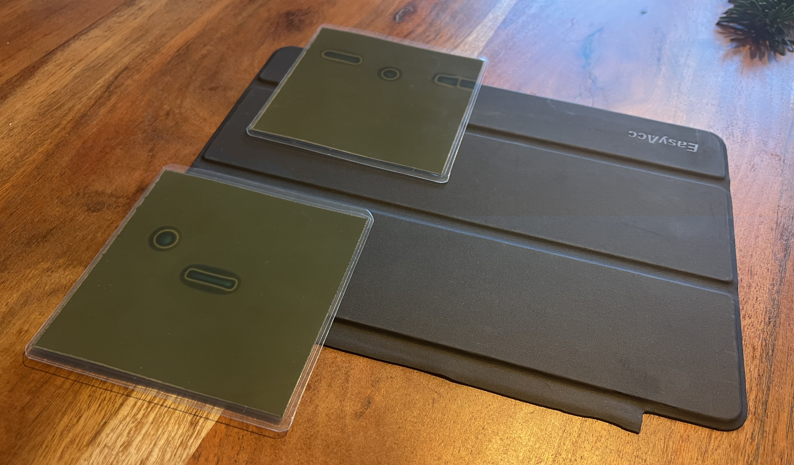
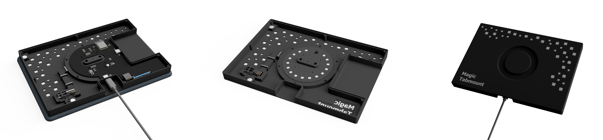

# Magic Tabmount

Der "Magic Tabmount" ist eine smarte Wandhalterung für das iPad (Generation 5 bis 9). Durch ein integriertes Magnetsystem kann das iPad mit einem Handgriff an der Wand befestigt oder wieder entfernt werden.

Ferner verfügt die Baugruppe über eine integrierte Schaltung, die mittels Radarwellen die Anwesenheit von Personen um das iPad herum detektiert. Werden Personen erkannt, wird das iPad Display aktiviert und bei Abwesenheit deaktiviert.

## Projektmotivation

Insbesondere die älteren iPad Modelle entsprechen heute nur noch selten den Leistungsanforderungen ihrer Nutzer. Aufgrund des geringen Wiederverkaufswerts enden sie entsprechend häufig ungenutzt in der Schublade. Eine Wandmontage ermöglicht verschiedene Anwendungsmöglichkeiten, für die auch eine ältere Hardware noch geeignet ist. Zum Beispiel:

- Smart Home Steuerungszentrale
- Familien Planer
- Musik Steuerungszentrale
- Dashboards für Fitness/ Stromverbrauch etc.
- Ticker und Nachrichten
- und viele mehr...

Ästhetisch war es mir wichtig, das originale Look and Feel des iPads beizubehalten. Um das Gerät scheinbar unsichtbar montieren zu können, wird auf die Geräterückseite ein Magnetring geklebt, der an der iPad Halterung passgenau gehalten wird.

Die automatische Aktivierung des Displays bei Annäherung fühlt sich nicht nur magisch an, sondern spart auch Zeit und erfordert nicht den Einsatz der Hände, was insbesondere beim Kochen nützich ist.

[PLATZHALTER VIDEO]

## Technische Challange

In erster Linie ist das Projekt eine technische Challange, denn Apple stellt keine Schnittstelle bereit, um den Aktivierungszustand des Displays zu steuern. Für eine gute Nutzbarkeit in geschützem privaten Umfeld war es jedoch wichtig, dass die zuletzt geöffnete App direkt nach Aktivierung des Displays sichtbar wird.

Um auch den notwendigen Zwischenschritt des "Entsperrens" zu umgehen, habe ich mir ein iPad Display Cover näher angesehen. Klappt man dieses zu und wieder auf, wird das iPad bei deaktiviertem Pincode automatisch entsperrt.

Hierzu verfügt das iPad über zwei magnetoresistive Sensoren, die erkennen, dass ein Smart Cover montiert ist und ob dieses auf- oder zugeklappt ist. Mit einer speziellen Folie, lassen sich die im Cover verbauten Magnete sichtbar machen. Die zwei runden Magnete sind für die Sperrung/Entsperrung des Displays erforderlich.

## Integrierte Schaltung

Die Wandhalterung positioniert einen Permanentmagneten an der oberen linken Gerätekante, um die Anwesenheit eines Smart Covers zu simulieren. Ein zweiter Magnet an der unteren Geräteseite sperrt das Display bei Anwesenheit und entsperrt es bei Abwesenheit. Stellt man die automatische Displaysperre des iPads aus, kann der Displayzustand vollständig durch den iPad Halter bestimmt werden.

Der Einsatz eines Elektromagneten an der unteren Geräteseite liegt initial auf der Hand. Jedoch ist der im iPad verbaute Magnetsensor auf der Geräteoberseite verbaut. Daher muss ein besonders starkes Magnetfeld aufgebaut werden, welches geeignet ist den Sensor durch Gehäuse, Akku und Display hindurch zu aktivieren. Der Einsatz eines Elektromagneten würde hier zu einem hohen permaneten Stromverbrauch führen.

Daher habe ich mich dazu entschlossen, einen starken Neodymmagnet einzusetzen, der durch einen kleinen Stepper Motor verschoben wird. Dies führt zu einem minimalen Stromverbrauch, da nur beim Änderung des Displayzustandes Energie benötigt wird.

In Summe integriert die Schaltung entsprechend einen mmWave-Radarsensor, zur Anwesenheitserkennung von Personen, einen kleinen Stepper Motor zur Verschiebung des Magneten, sowie entsprechender Steuerungselektronik.

## Planung der Elektronik

Um den Stromanschluss der Platine mit einer Lademöglichkeit des iPads zu kombinieren, habe ich zwei USB C Anschlüsse auf der Platine verbaut. Der nach unten ausgerichtete Port, ist für ein Stromkabel vorgesehen. Der zweite Port ist auf gleicher Höhe wie der Lightning Anschluss des iPads positioniert. Somit kann ein kurzes Verbindungskabel zwischen iPad und Wandhalterung zum Laden des iPads eingesetzt werden.

Zur Auswertung der Signale und Steuerung der Logik ist ein Mikrocontroller verbaut, der direkt über den Host Port programmiert werden kann. Zur Steuerung des Motors wird zudem ein Stepper Treiber benötigt. Der Umfang der Elektronik und entsprechender Komplexität erfordert ein Custom-PCB Design, welches ich mit KiCad umgesetzt habe.

Für eine besondere, persönliche Note, habe ich das vorderseitige Produktlogo aus Semi-Transparentem Material gedruckt, um es aktiv zu hinterleuchten. Somit integriert die Platine zusätzlich vier RGB LEDs, die über den Mikrocontroller gesteuert werden. Ein rückseitig verbauter Hall-Sensor prüft, ob das iPad anliegt, oder nicht. Sobald das iPad angelegt ist, wird die Logobeleuchtung ausgeschlatet.

### PCB Layout

Aufgrund der hohen Anzahl an Elektronik Komponenten, habe ich versucht ausschließlich auf SMD Komponenten zu setzen, sodass ich einen Großteil der Komponetnten mittels Stencil bestücken konnte. Funktionsbedingt musste lediglich der Hall Sensor zur Geräteerkennung, als auch die Logobeleuchtung auf die Unterseite des PCBs gelegt werden.

### Ergebnis

Mittels Stencil und Hot-Plate ließen sich alle Komponenten schnell und einfach verlöten. Das PCB wird mit vier Schrauben im Gehäuse befestigt und der Stepper Motor am Platinenrand verlötet. Für die Zukunft wäre ein Stecker praktikabeler, jedoch war diese Lösung kurzfristig am kostengünstigsten.

Die seitliche Tasche ermöglicht es ein Standard USB C auf Lightning Kabel einzurollen und das Gerät über einen Winkeladapter zu laden.

## Gehäuse

Während des Prototypings und ohne sonderlichen Fokus auf einen marketingtauglichen Namen, lief der Wandhalter unter dem Projektnamen "Magic iPad Wallmount". Um keine Markenrechte zu verletzten, änderte ich den Namen zum Projektende auf Magic Tabmount.

Das Gehäusedesign sollte initial kleinstmöglich und funktionsorientiert gestaltet sein.

Problemtaisch war der Magnet an der oberen Geräteecke, ohne den eine Steuerung des Displays nicht möglich war. Der zuerst aufgeklebte Magnet störte bei der Bedienung des Tablets in der Hand, weswegen ich das Design an die Gerätemaße anglich, um den Magnet zu integrieren.

Hinter einer kraftschlüssig aufgesetzten Kappe, liegen zwei Schraubpunkte, über die der Halter an der Wand montiert werden kann.

Für eine gute Druckbarkeit des Gehäuses und einheitliche Oberflächen, mussten alle Oberseiten auf der Druckplatte des 3D Druckers aufliegen.

Daher ist der innere Ring mehrteilig gedruckt und anschließend formschlüssig montiert und verschraubt.
